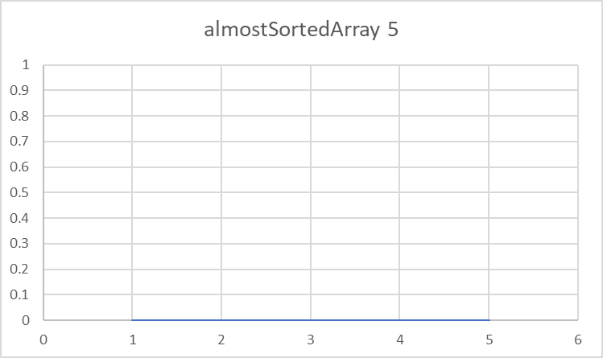
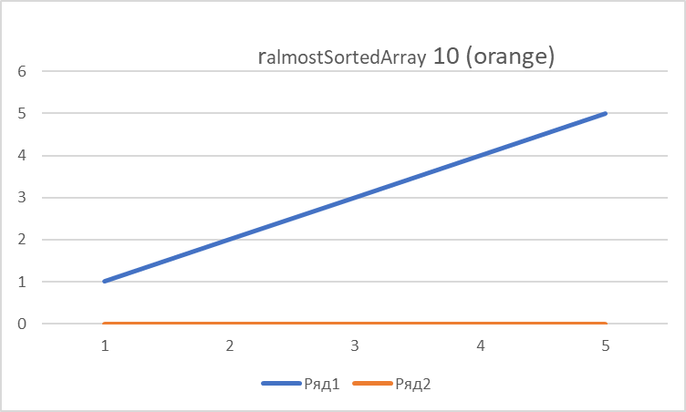

# A2
## Сравним Алгоримты Сортировки MergeSort и MergeSort + InsertionSort

Для MergeSort я сортировал 800 элементов для каждого массива:
\
### Исходные данные
Любые 800 элементов в массивах
Делал 6 замеров и измерял все в микросекундах.\
randomArray: 467, 618, 521, 477, 501, 560. Average: 524\
reversedArray: 415, 564, 676, 718, 415, 483. Average: 545.1666667\
almostSortedArray: 617, 445, 506, 421, 420, 550. Average: 493
### Графики для этих групп

## Исходные данные для гибридного метода сортировки
Т.к. сравниваем мы скорость на маленьких данных, то брать мы будем маленькие диапазоны.
По условию: 5, 10, 20, 50 элементов соответсвенно. Выбирал любые 5, 10, 20, 50 элементов их массива.
Делал 5 замеров в микросекундах.\
### randomArray: 
5: 1, 0, 0, 0, 0. Average: 0.2\
10: 0, 0, 1, 1, 0. Average: 0.4\
20: 1, 1 , 0, 1, 1. Average: 0.8\
50: 6, 6, 8, 9, 6. Average: 7\
В сравнении, я приведу MergeSort на размере 50 элементов\
50: 78, 47, 38, 33, 61. Average: 51.4
### reversedArray: 
5: 0, 0, 0, 0, 0. Average: 0\
10: 1, 1, 1, 1, 1. Average: 1\
20: 2, 2 , 2, 3, 2. Average: 2.2\
50: 10, 10, 15, 10, 10. Average: 11\
В сравнении, я приведу MergeSort на размере 50 элементов\
50: 41, 43, 29, 41, 44. Average: 39.6
### almostSortedArray: 
5: 0, 0, 0, 0, 0. Average: 0\
10: 0, 0, 0, 0, 0. Average: 0\
20: 0, 0, 0, 0, 1. Average: 0.2\
50: 0, 0, 1, 0, 0. Average: 0.2\
В сравнении, я приведу MergeSort на размере 50 элементов\
50: 30, 31, 29, 44, 29. Average: 32.6\
### Графики

и график MergeSort на тех же данных

/////////////////////////

/////////////////////////

## Вывод
Как мы можем видеть, разброс гибридного алгоритма на маленьких данных не очень то и велик. Есть скачки на 1 - 5 микросекунд.\
В сравнении с MergeSort, Гибридный алгоритм работает быстрее на маленьких данных, это мы отчетливо видим на графиках и на средних значениях времени.
По замерам работы MergeSort можно сказать, что сортировка reversedArray заняла больше всего времени(если смотреть по среднему), а самым быстрым в сортировке оказался almostSortedArray.

