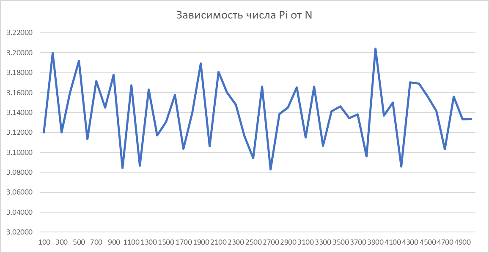
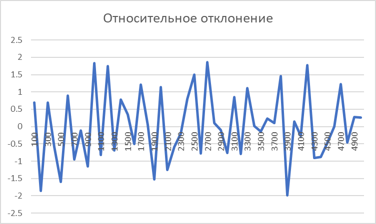

# Эксперименты
## 2.
Возьмем значения которые подсчитала нам программа.\
N = [100, 200, 300..., 5000]\
\
M = [3.12,
3.2,
3.12,
3.16,
3.192,
3.11333,
3.17143,
3.145,
3.17778,
3.084,
3.16727,
3.08667,
3.16308,
3.11714,
3.13067,
3.1575,
3.10353,
3.14,
3.18947,
3.106,
3.18095,
3.16,
3.14783,
3.11667,
3.0944,
3.16615,
3.08296,
3.13857,
3.14483,
3.16533,
3.11484,
3.16625,
3.14118,
3.14629,
3.13444,
3.13838,
3.09579,
3.2041,
3.137,
3.15024,
3.08571,
3.17023,
3.16909,
3.15644,
3.14174,
3.10298,
3.15583,
3.13306,
3.1336
]

Построим график, в котором число π зависит от общего числа N

 
Относительно отклонение. За число пи брал значение = 3.14159265359

На графике, все что ниже 0 - превысило точное значение числа ПИ, выше - все что меньше.
Строил с помощью Excel.(не особо понял как менять маштаю осей)\

По полученным данным можно сказать, что все значения разные, какие - то больше числа пи, какие - то меньше.
Отклонения от точного числа примерно от 3.08 до 3.2\
Самое точное значение которое я получил в результате одиночного прогона - 3.14148\
Относительное отклонение по графику от (-1.98967 до 1.866355)
 

