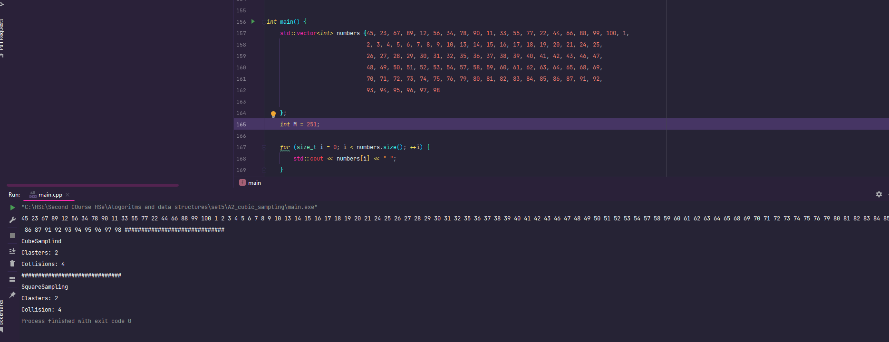
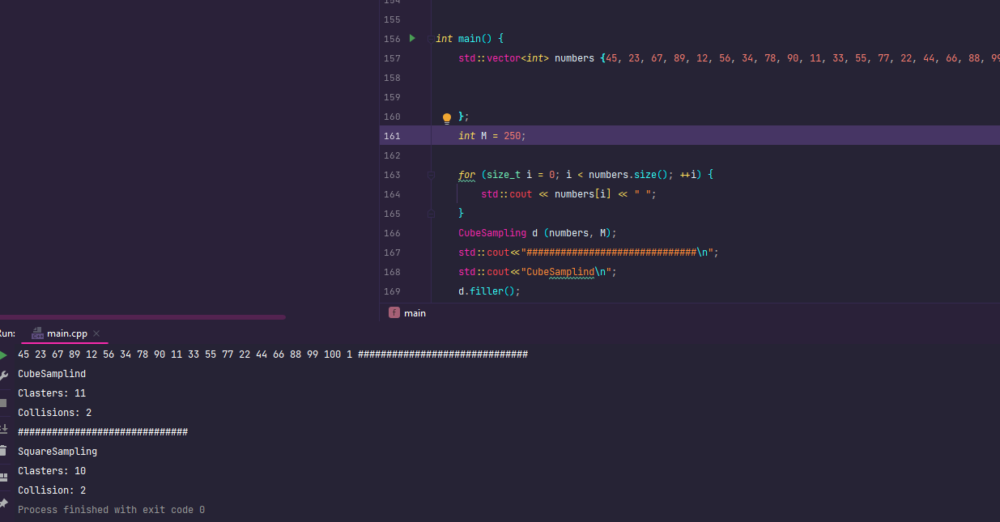
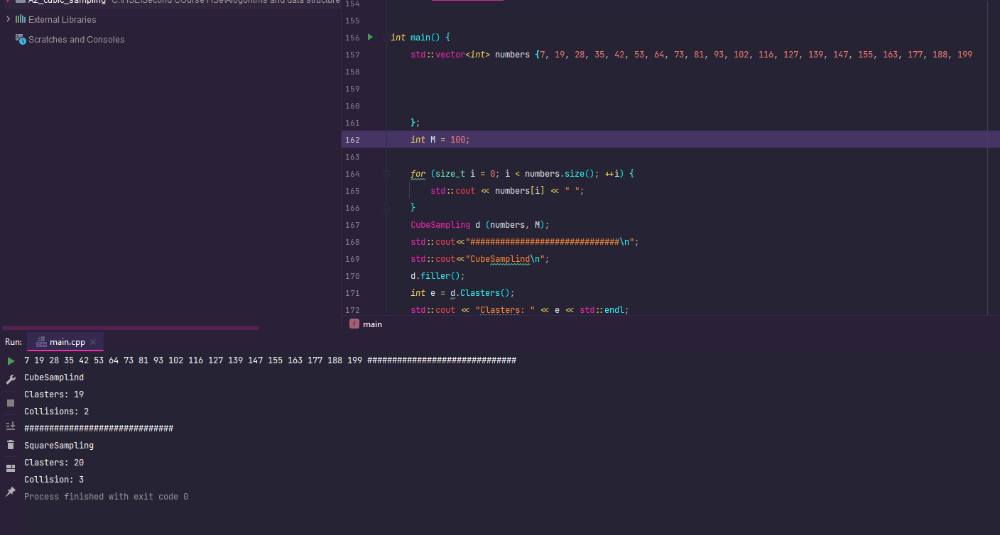
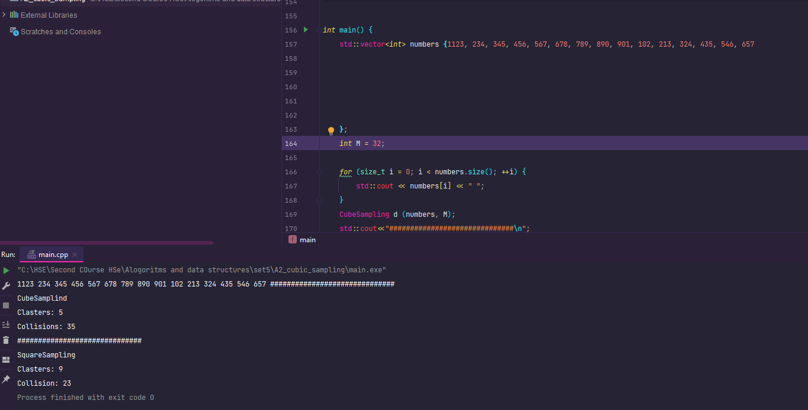
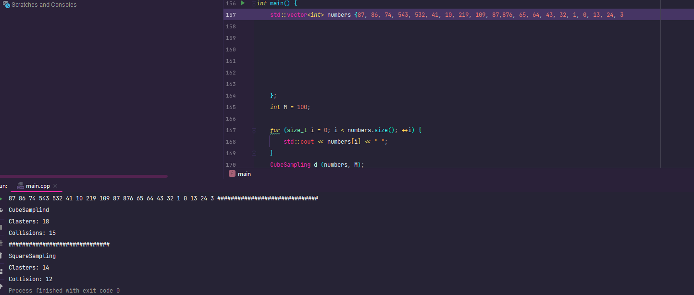

Я взял хеш таблицу размером 2^6 степени и элементы \
64 128 192 256 320 384 448 1 65 129 193 257 321 385 449 2 66 130 194 258 322 386 450 3 67 131 195 259 323 387 451
0
Нуль в конце говорит, что ввод должен быть прекращен.
Произвел два пробирования - квадратичное и кубическое

\
как мы видим, в при разных данных разные результаты